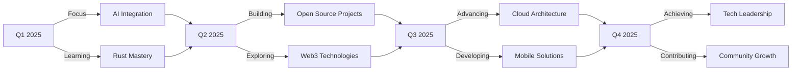

# 👋 Hey there! I'm Cache Developer

<div align="center">
  
</div>


## 🚀 About Me

```typescript
const CacheDeveloper = {
    pronouns: "He/Him",
    location: "🌍 Global Citizen",
    currentFocus: ["Full-Stack Development", "System Architecture", "Open Source"],
    workingOn: ["Innovative Web Applications", "Mobile Solutions", "AI Integration"],
    learning: ["Advanced System Design", "Cloud Architecture", "Machine Learning"],
    askMeAbout: ["Web Development", "Mobile Apps", "System Design", "Tech Career"],
    funFact: "I debug with console.log and I'm not ashamed! 😄",
    motto: "Code with passion, build with purpose ✨"
};
```

## 🎯 Current Focus Areas

<div align="center">
  
| 🎨 **Frontend Magic** | ⚙️ **Backend Engineering** | 📱 **Mobile Innovation** |
|:---:|:---:|:---:|
| Creating stunning UIs | Building robust APIs | Cross-platform solutions |
| Modern frameworks | Scalable architectures | Native performance |
| Responsive designs | Database optimization | User experience focus |

</div>

<!-- Stats -->
<div align="center">
  
## 📊 GitHub Analytics 📈

   </br>
  
   </br>
  
  
  
</div>

## 🏆 GitHub Achievements

<div align="center">
  
  
  
</div>

<!-- Tech Stack -->
<div align="center">
  
## 💻 Tech Stack Arsenal ⚡

### 🌟 Core Languages & Expertise
        

### 🎯 Specialized Languages
        

### 🔮 Functional & Advanced Languages
        

### 🧪 Emerging & Research Languages
      

### 🏛️ Enterprise & Scientific Languages
       

### 🔧 System & Scripting Languages
      

### 🎨 Unique & Esoteric Languages
           

### 🌐 Frontend & UI Frameworks
       

### 🎯 Core Web Technologies & Styling
       

### ⚙️ Backend & Server Technologies
       

### 🐍 Python Ecosystem
    

### 📱 Mobile Development Ecosystem
      

### 🖥️ Desktop Development Solutions
     

### 🗄️ Database & Storage Solutions
       

### ☁️ Cloud & BaaS Platforms
    

### 🐳 DevOps & Container Orchestration
    

### 🔄 CI/CD & Automation
     

### ☁️ Cloud Platforms & Services
     

### 🚀 Deployment & Hosting
     

### 🔗 APIs & Integration Technologies
     

### 🛠️ Development Tools & IDEs
        

### 📦 Package Managers & Build Tools
     

### 🔍 Version Control & Collaboration
    

### 🧪 Testing & Quality Assurance
       

### 🔧 API Testing & Documentation
   

### 💻 Operating Systems & Environments
       

### 🎨 Design & Creative Tools
       

### 🎥 3D & Animation Tools
   

### 📊 Data Science & Machine Learning
         

### 🤖 AI & ML Platforms
   

### 🔌 Hardware & IoT Development
   

### 📱 Content Management & E-commerce
     

### 🛠️ Productivity & Project Management
        

### 🔐 Security & Authentication
   

### 🏗️ Infrastructure as Code
   

### 📈 Monitoring & Analytics
    

</div>

## 🚀 Featured Projects & Contributions

<div align="center">

### 🌟 Pinned Repositories
[](https://github.com/cachedeveloper/awesome-project-1)
[](https://github.com/cachedeveloper/innovative-solution)

</div>

## 📖 Latest Blog Posts & Articles

<!-- BLOG-POST-LIST:START -->
- 🚀 Building Scalable Microservices with TypeScript and Docker
- 🎨 Modern CSS Techniques for Responsive Design
- 🔧 Optimizing React Performance in Large Applications
- 📱 Cross-Platform Mobile Development Best Practices
- ☁️ Deploying Full-Stack Applications on AWS
<!-- BLOG-POST-LIST:END -->

## 🎯 2025 Goals & Roadmap



## 🏆 Certifications & Achievements

<div align="center">

| 🥇 **Cloud Platforms** | 🎯 **Development** | 🔒 **Security** |
|:---:|:---:|:---:|
| AWS Certified Solutions Architect | Full-Stack Development Specialist | Cybersecurity Fundamentals |
| Google Cloud Professional | Microservices Architecture | Secure Coding Practices |
| Azure Developer Associate | DevOps Engineering | Data Protection & Privacy |

</div>

## 📊 Weekly Development Breakdown

```text
TypeScript   █████████████████████░░░░   85.2%
Python       ██████████░░░░░░░░░░░░░░░░   42.3%
Rust         ████████░░░░░░░░░░░░░░░░░░   32.1%
Go           ██████░░░░░░░░░░░░░░░░░░░░   28.7%
Java         █████░░░░░░░░░░░░░░░░░░░░░   21.4%
```

## 🌍 Open Source Contributions

<div align="center">
  
  
  
</div>

## 🎨 UI/UX Design Philosophy

> "Great software is not just about clean code—it's about creating experiences that users love and remember."

- **🎯 User-Centric Approach**: Every design decision starts with user needs
- **⚡ Performance First**: Beautiful interfaces that load lightning fast
- **📱 Mobile-First Design**: Seamless experiences across all devices
- **♿ Accessibility Matters**: Inclusive design for everyone
- **🌈 Consistent Branding**: Cohesive visual language across platforms

## 💡 Programming Principles I Live By

```javascript
const codingPhilosophy = {
    principles: [
        "Write code that tells a story",
        "Optimize for readability, then performance",
        "Test early, test often, test everything",
        "Documentation is love letters to your future self",
        "Refactor fearlessly, deploy confidently"
    ],
    values: {
        collaboration: "Code reviews are learning opportunities",
        innovation: "Stay curious, embrace new technologies",
        quality: "Done is better than perfect, but quality is non-negotiable",
        growth: "Every bug is a lesson, every feature a chance to improve"
    }
};
```

## 🤝 Collaboration & Communication

<div align="center">

| 💬 **Communication Style** | 🎯 **Collaboration Approach** | 🌟 **Leadership Philosophy** |
|:---:|:---:|:---:|
| Clear & Direct | Agile & Adaptive | Lead by Example |
| Active Listening | Cross-functional Teams | Mentorship Focus |
| Technical Writing | Code Reviews & Pair Programming | Continuous Learning |

</div>

## 📚 Currently Reading & Learning

- 📖 **"Designing Data-Intensive Applications"** by Martin Kleppmann
- 🧠 **"System Design Interview"** by Alex Xu
- 🚀 **"The Pragmatic Programmer"** by Andy Hunt & Dave Thomas
- 🎯 **Advanced Rust Programming Patterns**
- ☁️ **Kubernetes & Cloud-Native Architecture**
- 🤖 **Machine Learning Engineering Practices**

## 🎵 Coding Soundtrack

When I'm in the zone, you'll find me coding to:
- 🎶 Lo-fi Hip Hop & Chillhop
- 🎸 Progressive Rock & Post-Rock
- 🎹 Ambient & Electronic Music
- 🎼 Video Game Soundtracks
- ☕ Coffee Shop Ambience

## ⚡ Fun Facts About Me

- 🌙 **Night Owl**: Most productive coding happens between 10 PM - 2 AM
- ☕ **Coffee Enthusiast**: Can't start coding without a perfect cup of coffee
- 🎮 **Gaming Geek**: Love playing indie games and retro classics
- 📸 **Photography Hobbyist**: Capturing code in nature (literally!)
- 🧩 **Problem Solver**: Enjoy solving complex puzzles and brain teasers
- 🌱 **Tech Gardener**: Always nurturing new projects and ideas
- 🎨 **Digital Artist**: Creating pixel art and UI illustrations in spare time

## 🌐 Connect with Me 🍬

<div align="center">

[](https://github.com/cachedeveloper) 
[](https://linkedin.com/in/cachedeveloper) 
[](https://cachedeveloper.dev)
[](mailto:contact@cachedeveloper.dev)
[](https://discord.gg/cachedeveloper) 
[](https://x.com/cachedeveloper) 
[](https://dev.to/cachedeveloper)
[](https://medium.com/@cachedeveloper)
[](https://stackoverflow.com/users/cachedeveloper)

</div>

## 💬 Let's Build Something Amazing Together!

<div align="center">

**"The best way to predict the future is to code it."**

Whether you're looking to collaborate on an exciting project, need technical consultation, or just want to chat about the latest in tech, I'm always open to connecting with fellow developers and innovators!

📧 **Business Inquiries**: [business@cachedeveloper.dev](mailto:business@cachedeveloper.dev)  
💻 **Technical Discussions**: [tech@cachedeveloper.dev](mailto:tech@cachedeveloper.dev)  
🤝 **Collaboration**: [collab@cachedeveloper.dev](mailto:collab@cachedeveloper.dev)  

</div>

---

<!-- Snake Animation -->
<div align="center">
    
  
</div>

<!-- Visit Counter -->
<div align="center">
  
  
  [](https://visitcount.itsvg.in)
  
  **Thanks for visiting! Happy coding! 🚀✨**
  
</div>
